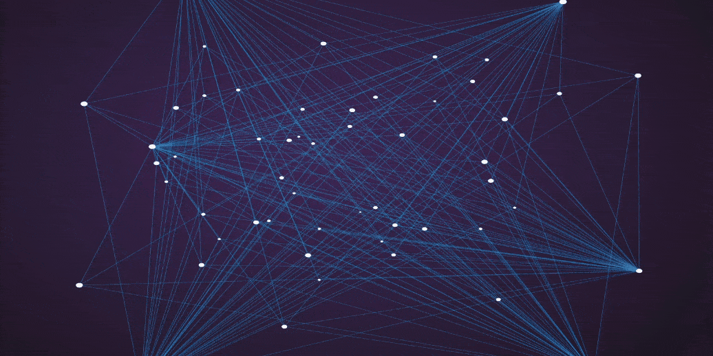

  
  

### 
I'm Niloy,  a student of computer science and engineering
  
  

- 📍 I'm from Bangladesh🇧🇩  

- 🌱 I’m passionate about becoming a software engineer.  
  
- 🐍 I'm currently learning Python  
  

   

## 𝐒𝐊𝐈𝐋𝐋s
### Programming Languages
**C | C++ | C# | JavaScript | Java | Python**
### Front-End
**HTML | CSS | Bootstrap | JavaScript**
### Database
**MySQL | SQLite**
### Tools
**Git | Microsoft Office (MS word, Excel, PowerPoint)**
### Design
**Basic Graphics Design | UI/UX Design**
### Others
**Data Structures and Algorithms | Android Development**

</td><td valign="top" width="33%">

</td><td valign="top" width="33%">

</td></tr></table>  

   

## Connect with me  

  

  
  

   

## Github Stats 

   
